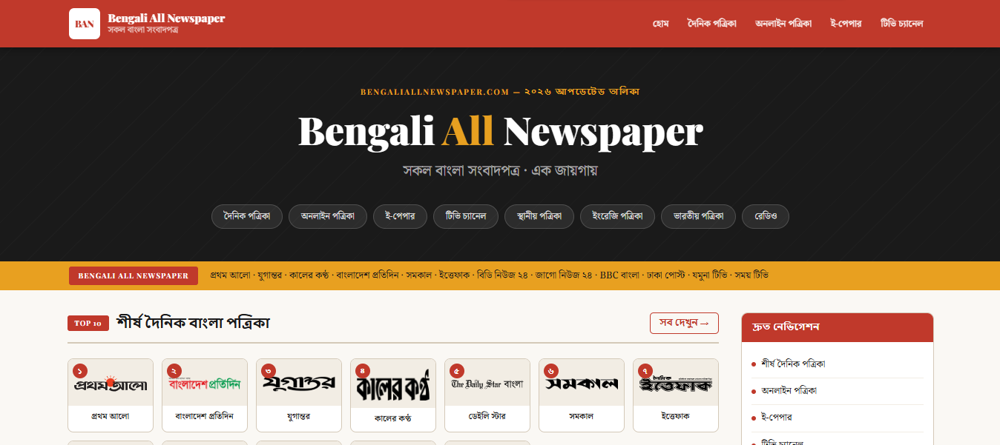

# Bengali All Newspaper

**সকল বাংলা সংবাদপত্র — এক জায়গায়**  
A clean, modern, responsive single-page directory of all major Bengali newspapers, online news portals, e-papers, TV channels, local papers, English dailies from Bangladesh, Indian Bangla newspapers, and FM radio stations.

  
*(Replace with actual screenshot when you host it)*

Live Demo: [https://bengaliallnewspaper.com](https://bengaliallnewspaper.com) *(update with your actual domain)*  
Last Major Update: February 2026

## ✨ Features

- Clean, elegant design with red-gold-cream color theme
- Sticky header with logo and navigation
- Animated hero section with pill-style category links
- Scrolling news ticker of popular outlets
- Top 10 daily newspapers with ranked cards + logos
- Categorized grids for:
  - Daily newspapers
  - Online news portals
  - E-papers
  - Bangla TV channels (live/news)
  - Local/regional newspapers
  - English newspapers from Bangladesh
  - Indian Bangla newspapers
  - Bangla FM radio stations
- FAQ accordion
- Responsive layout (mobile-first, collapses gracefully below 960px & 640px)
- Lazy-loaded images
- Smooth scroll + fade-in animations on scroll
- SEO-friendly meta tags and Open Graph/Twitter cards
- Dark-mode ready variables (easy to extend)

## 🛠️ Tech Stack

- **HTML5** + **CSS3** (vanilla, no framework)
- Google Fonts: Playfair Display, Source Serif 4, Noto Serif Bengali
- CSS Custom Properties (variables) for theming
- Intersection Observer API for fade-in animations
- Pure CSS responsive grid (auto-fill minmax)
- No JavaScript frameworks — only ~30 lines of vanilla JS for FAQ & scroll effects

## 📂 Project Structure
bengali-all-newspaper/  
├── index.html          # Main single-page file 
├── README.md           # This file  
└── (optional folders)  
├── assets/         # For local logos, screenshots, favicons  
├── css/            # If you later extract styles  
└── js/             # If you later extract scripts  
